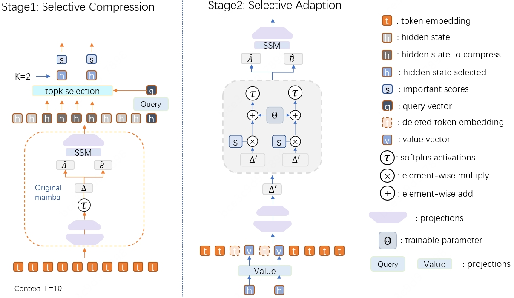

# ReMamba: Equip Mamba with Effective Long-Sequence Modeling

<p align="center">


<a href="https://arxiv.org/abs/2408.15496"></a>

</p>


<br>

# Setup
## Clone Project
```
git clone https://github.com/yuandanlong/ReMamba.git
cd ReMamba
```

## Create Environment
To set up our environment, please run:
```
conda env create -f environment.yml
conda activate ReMamba
```

Install Mamba:
```
pip install causal-conv1d==1.4.0
pip install mamba-ssm==2.2.2
```
# Data Generation
for mamba training data just run: 
```
sh ./sh/mambadata.sh 
```

for llama training data just run: 
```
sh ./sh/llamadata.sh 
```
Here the max length is set to 2k.
please modify the normal_datapath and long_datapath to your own data paths.

"topic_retrieval_longchat",
# Training
For ReMamba, we use the huggingface implementation because we can witness best performance here.
run:
```
cd Remambahf
sh ./sh/remamba.sh 
```
please modify the logging_dir, output_dir, dataset_name, longdataset_name to your own path here


For ReMamba2, there is no huggingface implementation yet. So we use the original implementation.  
run:
```
cd Remamba2
sh ./sh/remamba.sh
```
You also need to modify some parameters here.
This code can also be used for training ReMamba(no 🤗hf version), you need to change the lora config and base model path for ReMamba.


To train mamba just run:
```
cd hopemamba2.8b
sh ./sh/deepspeedmamba2.8.sh
```
You need to modify some parameters in the ModelArguments of ./deepspeedmamba2.8.py

To train llama2-3b just run:
```
cd hope-llama3b-longctx
sh ./sh/deepspeedtransformer.sh
```
You also need to modify some parameters here.

# Evaluate ReMamba
We uploaded the weights of the ReMamba:
|Eval ID|Model type | Checkpoint | 
|----------|----------|----------|
|0|ReMamba|[🤗 assafbk/decimamba-130m-squad-doc-ret](https://huggingface.co/assafbk/decimamba-130m-squad-doc-ret)|

<br>

To run the LongBench evaluation :
```
cd LongBench/remamba
sh  ./loopReMambahf.sh
sh  ./loopReMamba2.sh
```
You need to modify some parameters in the sh file such as datapath,peftpath...

To run the L-Eval evaluation
First replace the L-Eval data path in LEval/hopeRemaba2/Baselines/LEval_config.py with your own data path.
Then run:
```
cd LEval/hopeRemaba
sh  ./loopRemamba.sh
sh  ./loopReMamba2.sh
```
<br>

# Speed performance
To test speed, you need to change some configurations in the speed/Speed.py : basepath, llamacfg, mambacfg, mamba2cfg
Then run:
```
cd speed
sh  ./run.sh
```


# Acknowledgments
We thank the authors of Mamba for their amazing work and contribution: https://github.com/state-spaces/mamba


# Citation
If you find this work useful, please cite the following:
```bibtex
@misc{yuan2024remamba,
    title={ReMamba: Equip Mamba with Effective Long-Sequence Modeling},
    author={Danlong Yuan and Jiahao Liu and Bei Li and Huishuai Zhang and Jingang Wang and Xunliang Cai and Dongyan Zhao},
    year={2024},
    eprint={2408.15496},
    archivePrefix={arXiv},
    primaryClass={cs.CL}
}
```
